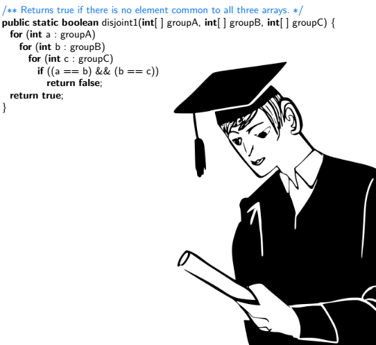

Hey! Great you are here, I really need to talk about something right now which is this whole idea of having a degree. I mean, a degree in Computer science major. But, I couldn’t. So I had to write..

A lot of people tend to ponder on what a Computer science degree is about and begin to ask if they could just go to a university, polytechnic, attend a boot-camp or be self-taught. This then inspired me to write this article and try to share my knowledge on what a Computer Science degree is and what a degree is actually. Oh! I’m a Computer Science student.

___

## What is this Computer Science though?

According to Jarvis Johnson, an Engineering Manager at Patreon, he says Computer science is like a scientist doing a research, more often like in academia or more like a research function.

To me, computer science is basically just the knowledge behind the wheels or just a study rather than practical or production.

Generally, computer science is the study of the theory, experimentation and 
engineering that form the basics for the design and use of Computers.

>Now the real question here is, do you need to study Computer Science?

With my few years in school, I was taught to look at a problem and solve it mathematically. Thereby forgetting this problem needs to be programmed with code as a project which companies tend to expect of a computer science graduate.

>The question still remains, do I still need to study computer science?

## What Computer Science isn’t

Actually, Computer Science isn’t Software Engineering but Software Engineering is Computer Science. Sounds stupid? Okay, Yes.

Software Engineering is the study of how software itself is built, maintained and operated. But this is just a branch under Computer Science. So, if you think a Computer Science degree is actually useless then you most likely have that on-hands approach in the field of Software Engineering. If not?

>The question still remains, do i still need to study Computer Science?

#### Some important courses in Computer Science:

+ Introduction to Programming
+ Data Structure and Algorithm
+ System Analysis
+ Object-Oriented Programming(OOP)
+ Operating Systems(OP)
+ Statistics and Probability
+ Calculus

#### At the end of these courses, one should have little or more skills in:

+ Analyzing
+ Critical thinking
+ Efficiency
+ Knowledge of OOP
+ Logical thinking/reasoning
+ Simplifying/Methods of algorithm
+ Few languages’ concepts and reasons for such languages.

Yeah, I know you can still get all of those skills outside school, I mean these Computer Science fundamentals.

However, a one-time Chief Executive of Yahoo, 
[Scott Thompson](https://en.wikipedia.org/wiki/Scott_Thompson_%28businessman%29) was asked to resign after a fake CV. He said to have obtained Computer Science with Accountancy major but the said University replied he had just Accountancy. Fair enough, there was a growth in value of Yahoo after his departure which became a topic of if Computer Science degree is important.

According to 
[Andrew Binstock](https://www.linkedin.com/in/andrewbinstock/)
, he said “the ill-defined ‘equivalent’ affords plenty of room for candidates with demonstrated coding prowess but lacking academic familiarity. In sum, all are welcome to the party. And with that in mind. I raise my pen to you, dear readers - Software Engineer all”.

The truth behind Bindstock is that there is a learning path that determines if the supposed person is gainfully skilled and can deliver, I mean solve problems pre-defined to Computer Science.

I observed that computer science graduates come into the industry only to realize that the academia is actually different from the application.

Look at this critical question. More deep roles like Software Architects which are key roles in their specific systems. Do they actually need a Computer science degree or could be self-taught?

These degrees are just tradition. It is part of an established process and are there to prove that you completed such process and is considered acceptable performance. It doesn’t prove anything. If you think getting a degree and having to be self-taught should make you stronger, then follow it. And if you think being just self-taught is okay, follow it. We all have our different races.

An employer in a big tech company once said: if we ever get to meet a Computer Science BS graduate with experience and a Computer Science MS graduate with no experience, we do pick the BS graduate with experience and offer to pay his MS fee if he decides to further. Which makes gives more experience under his belt as years run by and a bigger top role in the company.

___

