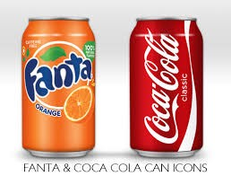
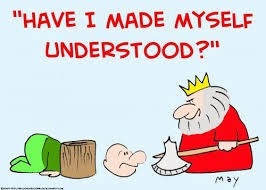

Most guys I actually came across in tech ignorantly misunderstood/misused the word Library and Framework. I mean, **in this 21st century life of programming, you should know that**.


*Hey tech dude, it’s a library not a framework, okay?*

Well, since you’re reading this now, keep reading so you don’t mess up again.

## What’s a Library?
These are just codes written by other developers, so it’s simply just a code reuse. You might just need a function to draw some sets of shapes for you. For example Turtle in Python which is a library.


```python
import turtle

silly = turtle.Turtle()

silly.forward(50)
silly.right(90)     # Rotate clockwise by 90 degrees

silly.forward(50)
silly.right(90)

silly.forward(50)
silly.right(90)

silly.forward(50)
silly.right(90)

turtle.done()
#this will give a square
```

So, a developer like You just needs to call this library called Turtle, and do some MAGIC.

So, in simple English a Library is a set of code that was previously written, that can be called upon when building your own code.


*Hope you got the library meaning?*


## What’s a Framework?
Everything is done inside, everything you need is inside the framework. Think about a framework as a set of tools put together to help you to accomplish your job better and faster. A framework is normally more complex. it contains libraries, compilers, etc.

Python can be used to do anything computing. But Django framework on Python is used to build web-apps and web services. Just imagine you want to write a web app from scratch(with just Python), you will have to start with a code that opens a port on your computer and listens on to that port for communication. When it receives a request on that port it will figure out the path that has been requested and what parameters etc has been passed.
Then it will problematically fetch the data that needs to be returned like html data or bla bla blaaa! But with Django as a Framework, you will create a method that reads:

```python
@app.route(‘/’)
def hello_world():
 return render_template(‘hello_world.html’)
```
and the framework will take care of the port opening/ listening/ http communication/ packet encoding bla bla bla and bla here.

So, in plain English, a **Framework is something that takes care of an enormous task so that big applications can be written in a simpler manner.**


*Are you lost?*

Let me give you a non-software analogy:

Imagine Coke and Fanta here. Just imagine it only, don’t wish to drink it.



Consider them as two different products having different way(framework) of producing a soft drink, having to taste different. Both might have different materials(libraries) like sugar, coloring, etc made by different companies or maybe them.



*Understood?*

___

**Don’t make this mistake again, please.**