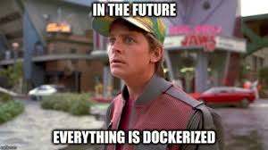
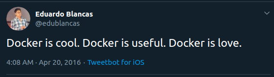
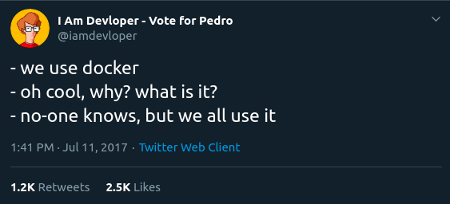
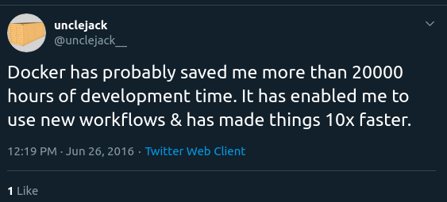
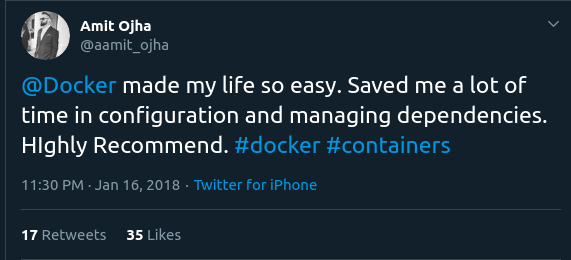
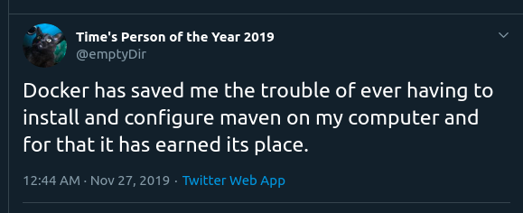
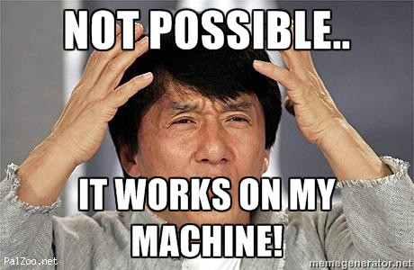
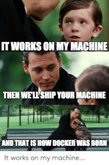
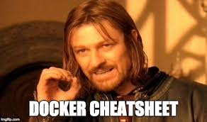

In this article, we will be looking at **Docker Simplified** I:                                      

+ Introduction. 
+ What the hell is Docker?  
+ Why Docker? 
+ Docker Components. 
+ Docker Tools.  

## Introduction    

 

Yes! Docker is one of the best things that has happened to Software development in recent years. Just in case you don't know what the hell Docker is, no better understanding of Docker or you need quick steps to use Docker, then you should read on.

> Docker, quite intimidating at first, but its importance which allows the use of containers can be easily handled when understood.

As our application grows, it becomes Monolithic, a self-contained computing application that performs every function/service. This becomes harder to manage. For example, let's say we're building a Node application that would be integrated with other libraries; a certain version of Node has to work with certain versions of other libraries/dependencies which works with your Operating system. Most often, if another team member runs that Node project/application on a different machine or computer they encounter errors.

This has to do with the different environments(my machine or computer could be different from yours). We then need a way to run that Node application on every environment(Linux, Mac, etc) without errors. This is where the container comes in. In today's Software development, instead of a huge Monolithic application that serves all function, we then need to look at different boxes(containers) that can be run on any other environment, each performing a function and also connected.

Enough of this long talk, let's jump into Docker for real.

---

## What the hell is Docker?

Docker is a tool that creates containers which holds everything needed to run your application.
It creates this stand-alone packages called containers that can pack, ship and deploy any application.
Docker containers allow a developer to write code, install all libraries and dependencies and ship it as a package, having it in mind that it can run on any machine.

> "Docker is an open-source project that automates the deployment of applications inside software containers.

This Docker container has its CPU, memory and network resources and it's independent on any  Operating System. More like a Virtual machine but not one. Virtual machines create a Virtual Operating System while Docker allows the use of the same Kernel/Operating System as the application it's running on and this container is shipped without anything from the host computer.
So, with Docker, you can write code with others without worrying about whether a dependency/library will work on your Mac/Windows/Linux machine. 

Docker containers run on the host's Operating System. More containers(which are now micro-services) now use the same infrastructure.
One good thing about Docker is that it has no communication with the host machine(hardware), unlike the Virtual Machines which has to communicate with the hardware of the host allowing it to use more resources, which then becomes heavy.

With Docker, it is now easier to handle micro-services(written in any programming language and different libraries/dependencies) instead of that giant monolithic application.

For resources on Docker

+ [Wikipedia](https://en.wikipedia.org/wiki/Docker_(software))
+ [Dev.to](https://dev.to/azure/docker---from-the-beginning-part-i-28c6)
+ [Docker.com](https://www.docker.com/why-docker)

## Why Docker

Docker, open-source, was built for several reasons:

+ New developers onboard in the team don't have to install any library, development dependencies, etc again
+ No more stress over running Virtual machines
+ Environment consistencies
+ Faster deployment

## Docker Components

Docker, a set of the platform as a service (PaaS) renders three components

+ ##### Objects: 
  These are pieces or entities that are used to arrange a project/application in Docker. Consist of Images, Containers, and Services
    
  + Images:
        Read-only "source-code" for building the containers. They store and ship applications in it. You could use an existing image or write yours.

  + Containers:
        Organized units of Docker. An environment that runs our application. The image builds the container, the container runs it.

   + Services:
        Each service allows the management of the container.

+ ##### Registries:

    All images created are stored here. Millions of images are stored here, which you could pick depending on your choice. [Docker Hub](https://hub.docker.com/) is where you can view them. Docker Cloud is also a registry.

+ ##### Software:

    ***dockerd***, the Docker daemon, a background process(Docker engine) listens to request to manage Objects and Containers.

## Docker Tools

+ [Docker Compose](https://github.com/docker/compose): helps run multiple container Docker applications
+ [Docker Swarm](https://github.com/docker/swarm): a native clustering system for Docker containers
+ [Kitematic](https://github.com/docker/kitematic): allows easier use of Docker on Mac and Windows
+ [Docker Machine](https://github.com/docker/machine): allows one to create the Docker hosts either on your computer, cloud provider/service or your data centre.

Many other tools are available under development. And the good side is that they are Open-source!

So, no more funny errors when other team members want to contribute to that project.

We could now ship your machine

One sweet benefit is, Docker containers can be shared easily. Just a few docker commands and the application is running(you could just get a Docker cheatsheet).

In the next post, we will learn the Installation, Dockerfile, Docker Commands, and Docker Compose.

Bye for now.

