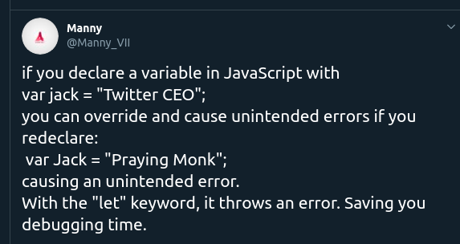
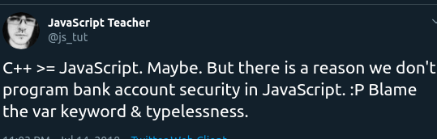
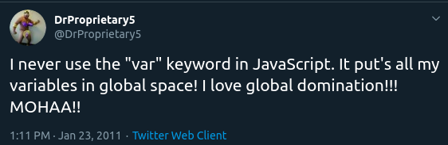
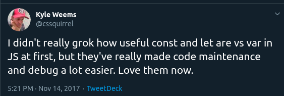
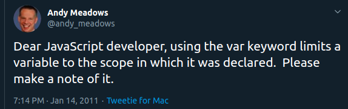
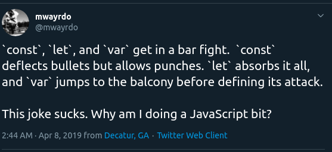
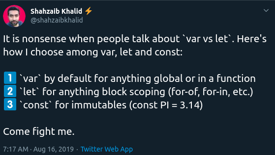
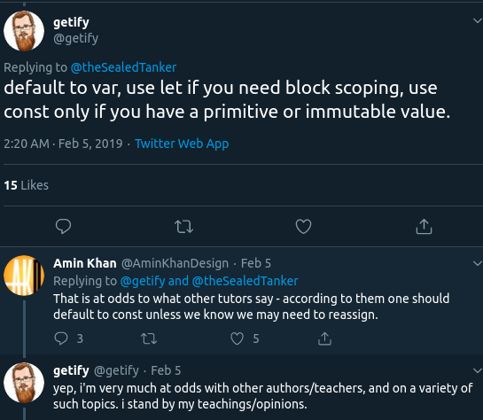
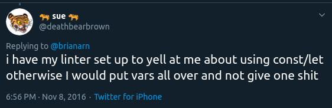

###### I know you hate JavaScript, but yeah, just read this article :smirk: .

One of the hot topics/arguments in the JavaScript community for over a while has been on the issue of ****let**** and ****const**** vs the ****var**** keywords. But, you know, all of these is just centered on misunderstanding and confusion. 

Hey! I'm not declaring that JavaScript is confusing. It is though, honestly :confused:.

Hold on, and let me settle this argument now :poop:.

___

## What var does normally?

Basically, we know the ****var**** keyword is function scope(not block scope), value can be updated, unlike ****const**** and do not act like ****let/const**** keyword in terms of scoping though.

****var**** is just one of those ways to declare variables in JavaScript which is mostly used, but guess what went wrong... 


## What went wrong?

- 
  
-   

-  

Check out the last tweet. You see it? I actually don't understand his joke still. If you do, please explain to me on Twitter via inbox [here](https://twitter.com/messages/256807178-1145973212326629376)  :eyes:

So, the confusion and misunderstanding is the thing, which is one of the reasons some folks hate JavaScript(their problem).


> The ****var**** keyword lacked proper scoping support for blocks unlike functions which was its only means to achieve scoping.

 But, guess what went right...

 

 Bored? Chill!

 ## What went right?

- 

-  

- 

The joke in the last tweet was quite understandable but I got lost in the last sentence :disappointed:.

The let and const keyword allowed 
- block scoping

```javascript

if (myAccount > 200k) {
    let safe = 'You can buy this Macbook Pro'
    console.log(safe) // You can buy this Macbook Pro
} else {
    let unsafe = 'You are a broke ass, fuck-off my store.'
    console.log(unsafe) // You are a broke ass, fuck-off my store. 
}

console.log(safe); // safe is not defined
cconsole.log(unsafe) // unsafe is not defined

```


- hoisting but no initialization(Temporal Dead Zone)

```javascript

console.log(favoriteMeal); // favoriteMeal is not defined

const favoriteMeal = 'Ice cream' 
```

- denial of redeclaration

```javascript
    let ass = 'big';
    let ass = 'small'; // ass is already defined 
```

Right now, the real problem is what should really be used. Ideally, ****var****, ****const**** and ****let**** all have their purposes and are quite important. Most common developers practice is starting all with ****const****, and converting them to ****let**** if rebinding arises. Others say they prefer ****let****. But, if you wouldn't rebind a variable, then why use ****let**** in the first place :smirk:?  

- 

- 

- 

For the last tweet, don't hire that guy. Or you are going to have bugs coming in everyday :laughing:.


##### This is what I advice/admit you should use:

- [ ] Don't use ****var**** in ES6.
- [ ] If rebinding arises, change to ****let****.
- [x] By default, use const.  


